# Lunara Inventory Platform

## Marca y enfoque

**Lunara Inventory Platform** es la marca propuesta para un sistema propio de inventario hotelero orientado a controlar abastecimiento, almacenamiento, consumo interno y trazabilidad operativa.

## Proceso operativo modelado

```mermaid
flowchart LR
    A["Administrador configura seguridad y catálogos"] --> B["Encargado crea productos y parámetros de stock"]
    B --> C["Encargado carga stock inicial o genera orden de compra"]
    C --> D["Proveedor entrega mercancía"]
    D --> E["Encargado recibe mercancía y genera entrada de inventario"]
    E --> F["Áreas internas crean solicitudes de insumos"]
    F --> G["Administrador o encargado aprueba o rechaza solicitudes"]
    G --> H["Encargado despacha productos y registra salida"]
    H --> I["Sistema recalcula stock, alertas y auditoría"]
    I --> J["Usuarios consultan dashboard, reportes y trazabilidad"]
```

## Módulos funcionales

1. Seguridad y control de acceso.
2. Catálogos maestros del hotel.
3. Gestión de productos y parámetros de inventario.
4. Compras y recepción.
5. Solicitudes internas y despachos.
6. Movimientos, alertas y auditoría.
7. Reportes, dashboard y exportación.

## Requisitos funcionales

| ID | Requisito | Descripción | Prioridad | Reglas de negocio | Criterios de aceptación | Usuario con acceso | Historia relacionada |
| --- | --- | --- | --- | --- | --- | --- | --- |
| RF-01 | Autenticación de usuarios | El sistema debe permitir el inicio de sesión con credenciales seguras. | Alta | Solo usuarios activos pueden ingresar. | Credenciales válidas generan token; inválidas retornan error. | Administrador / Encargado / Solicitante | Como usuario quiero iniciar sesión para acceder de forma segura al sistema. |
| RF-02 | Gestión de roles | El sistema debe crear, editar y consultar roles. | Alta | Cada usuario tiene un único rol. | Los roles se registran sin duplicidad. | Administrador | Como administrador quiero gestionar roles para controlar permisos. |
| RF-03 | Gestión de usuarios | El sistema debe registrar, editar, activar e inactivar usuarios. | Alta | Email y username son únicos. | El estado cambia correctamente y el usuario queda persistido. | Administrador | Como administrador quiero gestionar usuarios para controlar el acceso. |
| RF-04 | Gestión de áreas del hotel | El sistema debe registrar y actualizar áreas operativas. | Media | No se repiten nombres de área. | Las áreas quedan disponibles para solicitudes. | Administrador | Como administrador quiero registrar áreas para asociar solicitudes y consumos. |
| RF-05 | Gestión de bodegas | El sistema debe crear y administrar bodegas. | Alta | Una bodega inactiva no recibe movimientos nuevos. | La bodega puede asociarse al stock y movimientos. | Administrador / Encargado | Como encargado quiero administrar bodegas para controlar la ubicación del inventario. |
| RF-06 | Gestión de categorías | El sistema debe registrar categorías de productos. | Media | El nombre es único. | La categoría queda disponible al registrar productos. | Administrador | Como administrador quiero clasificar productos para facilitar su organización. |
| RF-07 | Gestión de unidades de medida | El sistema debe registrar unidades y abreviaturas. | Media | La abreviatura es única. | La unidad queda disponible para productos. | Administrador | Como administrador quiero definir unidades de medida para controlar cantidades. |
| RF-08 | Gestión de proveedores | El sistema debe registrar, editar y consultar proveedores. | Alta | La identificación tributaria es única. | El proveedor puede asociarse a productos y compras. | Administrador | Como administrador quiero gestionar proveedores para realizar compras. |
| RF-09 | Registro de productos | El sistema debe permitir crear productos del inventario. | Alta | El código del producto es único. | El producto se registra con categoría, unidad y proveedor válidos. | Administrador / Encargado | Como encargado quiero registrar productos para controlar el inventario. |
| RF-10 | Edición de productos | El sistema debe actualizar productos existentes. | Alta | No se puede cambiar a un código existente. | Los cambios quedan visibles en consultas. | Administrador / Encargado | Como encargado quiero actualizar productos para mantener información correcta. |
| RF-11 | Inactivación de productos | El sistema debe permitir inactivar productos. | Media | Un producto inactivo no se usa en operaciones nuevas. | El historial se conserva. | Administrador | Como administrador quiero inactivar productos sin perder trazabilidad. |
| RF-12 | Definición de stock mínimo | El sistema debe configurar stock mínimo por producto. | Alta | El valor no puede ser negativo. | Se usa para alertas de desabastecimiento. | Administrador / Encargado | Como encargado quiero definir stock mínimo para prevenir faltantes. |
| RF-13 | Definición de stock máximo | El sistema debe configurar stock máximo por producto. | Media | Debe ser mayor o igual al mínimo. | Queda asociado al producto y se usa en controles. | Administrador / Encargado | Como encargado quiero definir stock máximo para evitar sobreabastecimiento. |
| RF-14 | Consulta de stock por producto | El sistema debe consultar existencia actual por producto. | Alta | La cantidad mostrada debe estar actualizada. | La consulta retorna el stock correcto. | Administrador / Encargado | Como usuario quiero consultar el stock para tomar decisiones. |
| RF-15 | Consulta de stock por bodega | El sistema debe consultar existencias por bodega. | Alta | El producto puede visualizarse por ubicación. | La consulta muestra cantidades por bodega. | Administrador / Encargado | Como encargado quiero ver stock por bodega para ubicar productos. |
| RF-16 | Registro de stock inicial | El sistema debe cargar existencias iniciales. | Alta | Toda carga inicial genera trazabilidad. | Actualiza existencias y deja movimiento auditable. | Administrador / Encargado | Como encargado quiero registrar stock inicial para empezar a operar con datos reales. |
| RF-17 | Generación de órdenes de compra | El sistema debe crear órdenes de compra. | Alta | La orden contiene al menos un producto. | Se guarda con número único y estado inicial. | Administrador / Encargado | Como encargado quiero generar órdenes de compra para abastecer inventario. |
| RF-18 | Aprobación de órdenes de compra | El sistema debe aprobar órdenes antes de recibir mercancía. | Media | Solo usuarios autorizados pueden aprobar. | La orden cambia a aprobada. | Administrador | Como administrador quiero aprobar compras para mantener control. |
| RF-19 | Recepción de mercancía | El sistema debe registrar recepción total o parcial. | Alta | No se puede recibir más que lo ordenado. | Se actualiza el estado de la orden y aumenta stock. | Encargado | Como encargado quiero registrar recepción de mercancía para actualizar inventario. |
| RF-20 | Registro de entradas manuales | El sistema debe registrar entradas no asociadas a compra. | Media | La observación es obligatoria. | La entrada aumenta stock y queda trazable. | Encargado | Como encargado quiero registrar entradas manuales para reflejar excepciones. |
| RF-21 | Solicitud interna de insumos | El sistema debe permitir solicitudes desde áreas. | Alta | Debe incluir área, solicitante y al menos un producto. | Queda en estado pendiente. | Solicitante | Como usuario de un área quiero pedir insumos para abastecer mi operación. |
| RF-22 | Aprobación de solicitudes internas | El sistema debe aprobar o rechazar solicitudes. | Alta | Solo usuarios autorizados pueden decidir. | La decisión cambia el estado y queda registrada. | Administrador / Encargado | Como encargado quiero aprobar solicitudes para controlar salidas. |
| RF-23 | Despacho de productos | El sistema debe entregar productos aprobados. | Alta | No se despacha más de lo aprobado ni del stock disponible. | El despacho descuenta inventario y genera salida. | Encargado | Como encargado quiero despachar productos para atender solicitudes. |
| RF-24 | Registro de salidas manuales | El sistema debe registrar mermas o consumos extraordinarios. | Media | La salida debe justificar motivo. | Se descuenta stock sin permitir negativos. | Encargado | Como encargado quiero registrar salidas manuales para mantener el inventario real. |
| RF-25 | Control de stock negativo | El sistema debe impedir salidas que dejen saldo negativo. | Alta | Ninguna salida supera la disponibilidad actual. | La operación se bloquea con mensaje de stock insuficiente. | Sistema / Encargado | Como encargado quiero que el sistema evite stock negativo. |
| RF-26 | Alertas de stock bajo | El sistema debe generar alertas de stock crítico. | Alta | Se activa cuando stock actual es menor al mínimo. | El sistema lista productos en nivel crítico. | Administrador / Encargado | Como encargado quiero recibir alertas de stock bajo para reabastecer a tiempo. |
| RF-27 | Alertas de vencimiento | El sistema debe alertar productos próximos a vencer. | Media | Solo aplica a productos con control de vencimiento. | Muestra productos según rango configurado. | Administrador / Encargado | Como encargado quiero identificar vencimientos para evitar pérdidas. |
| RF-28 | Manejo de lotes | El sistema debe registrar lote por producto cuando corresponda. | Media | Solo algunos productos manejan lote. | El lote queda asociado al movimiento y a la trazabilidad. | Encargado | Como encargado quiero registrar lotes para controlar productos sensibles. |
| RF-29 | Historial de movimientos | El sistema debe consultar entradas, salidas y ajustes. | Alta | No se eliminan registros históricos. | La consulta muestra fecha, tipo, responsable, producto y cantidad. | Administrador / Encargado | Como administrador quiero consultar movimientos para auditar el inventario. |
| RF-30 | Trazabilidad por producto | El sistema debe ver todos los movimientos asociados a un producto. | Media | Debe incluir origen del movimiento. | La consulta lista operaciones en orden cronológico. | Administrador / Encargado | Como encargado quiero revisar trazabilidad por producto. |
| RF-31 | Búsqueda y filtros | El sistema debe buscar productos y movimientos por múltiples criterios. | Media | Los filtros se combinan sin perder integridad. | Devuelve resultados correctos por código, nombre, categoría, fecha o bodega. | Administrador / Encargado | Como usuario quiero filtrar información para encontrar datos rápido. |
| RF-32 | Reporte de inventario actual | El sistema debe generar reporte de inventario actual. | Alta | Debe reflejar el stock al momento de la consulta. | El usuario visualiza o exporta el reporte con datos actualizados. | Administrador / Encargado | Como administrador quiero generar reportes para controlar existencias. |
| RF-33 | Reporte de entradas y salidas | El sistema debe generar reportes de movimientos por fechas. | Media | Debe permitir filtrar por tipo de movimiento. | El reporte muestra entradas y salidas del período consultado. | Administrador / Encargado | Como administrador quiero reportes de movimientos para analizar consumos y compras. |
| RF-34 | Reporte de productos con stock bajo | El sistema debe listar productos bajo mínimo. | Alta | Solo aparecen productos activos con stock crítico. | El reporte muestra productos y cantidad actual. | Administrador / Encargado | Como encargado quiero ver productos con stock bajo para priorizar compras. |
| RF-35 | Auditoría de acciones | El sistema debe registrar eventos relevantes. | Media | Cada evento conserva fecha, usuario y acción. | La auditoría puede consultarse. | Administrador | Como administrador quiero tener auditoría para revisar acciones. |
| RF-36 | Control de permisos por módulo | El sistema debe restringir acciones por rol. | Alta | Un usuario solo ejecuta funciones autorizadas. | El sistema habilita o bloquea acciones según permisos. | Administrador | Como administrador quiero controlar permisos para proteger la operación. |
| RF-37 | Exportación de reportes | El sistema debe permitir exportar reportes. | Media | La exportación conserva filtros aplicados. | El archivo exportado mantiene la misma información mostrada. | Administrador / Encargado | Como usuario quiero exportar reportes para compartir información. |
| RF-38 | Dashboard de inventario | El sistema debe mostrar indicadores clave. | Baja | Los indicadores usan información actualizada. | El tablero muestra métricas resumidas al ingresar. | Administrador / Encargado | Como administrador quiero ver un resumen del inventario. |
| RF-39 | Registro de observaciones | El sistema debe guardar observaciones en compras, solicitudes y movimientos. | Baja | La observación queda asociada al registro. | El usuario guarda y consulta comentarios posteriores. | Administrador / Encargado | Como usuario quiero registrar observaciones para dejar contexto. |
| RF-40 | Consulta de productos por área consumidora | El sistema debe identificar áreas que consumen productos. | Media | La información se basa en solicitudes y despachos. | La consulta muestra áreas relacionadas con el producto. | Administrador / Encargado | Como administrador quiero saber qué áreas consumen más productos. |

## Entidades de base de datos

### Identity Service

- `roles`
- `users`

### Master Data Service

- `areas`
- `warehouses`
- `categories`
- `units`
- `suppliers`
- `products`

### Inventory Service

- `stocks`
- `purchase_orders`
- `purchase_order_lines`
- `internal_requests`
- `internal_request_lines`
- `inventory_movements`
- `inventory_movement_lines`
- `audit_events`

## Decisiones de arquitectura

1. Arquitectura en capas por servicio: `controller -> service -> repository -> domain`.
2. PostgreSQL como persistencia por microservicio con base separada.
3. JWT compartido entre servicios para autenticación distribuida.
4. Docker Compose para ejecución local integrada.
5. Reportes operativos en JSON y exportación CSV compatible con hojas de cálculo.
